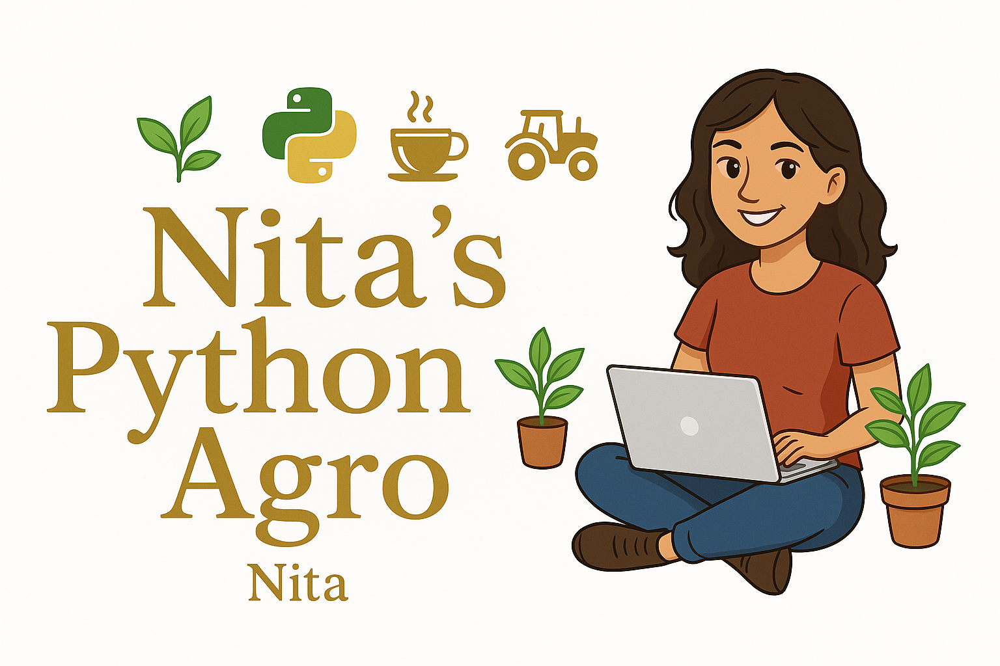

  

# nitas-python-agro

🌱 **Repositorio personal para experimentos y ejercicios de Python aplicados al sector agropecuario** 🌱

---

## Sobre este proyecto

Este es mi laboratorio digital para aprender y practicar Python en el agro.  
Aquí encontrarás scripts, análisis, visualizaciones y experimentos inspirados en retos reales: producción, clima, roya, suelos y más.

---

## Objetivos

- Aprender Python aplicando ejemplos agrícolas reales.
- Analizar y visualizar datos del agro (clima, café, suelos, plagas...).
- Automatizar procesos simples: lectura de sensores, simulaciones, avisos.
- Probar inteligencia artificial y estadística para el sector agropecuario.

---

## Estructura sugerida

- `01-saludo.py` — Primer script de bienvenida.
- `notebooks/` — Notebooks de experimentos y análisis.
- `datasets/` — Datos de ejemplo o simulados.
- `src/` — Código fuente de funciones/modulos más avanzados.

---

## Créditos

Creado por **Nitas**.  
Con apoyo moral de ChatGPT, la UCR y el mejor café de papá ☕😉

---

## Contacto

¿Sugerencias o colaboración?  
Escribime por karla.gamboa@proton.me.

---
